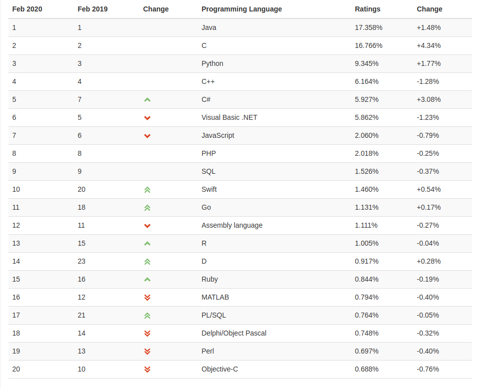

# FAQ для тех кто не в теме

## D это Delphi?

Нет, D к Delphi не имеет отношения. D -- следующая буква алфавита после C.
Это некоторый намёк на то, что D это более прогрессивный и новый язык,
созданный после C и C++.

## Виртуальная машина

D компилируется в нативный бинарный код под каждую поддерживаемую платформу,
отсутствует необходимость в виртуальной машине. Но в компиляторе ldc2 есть
возможность JIT-компиляции ([обсуждение](https://forum.dlang.org/thread/bskpxhrqyfkvaqzoospx@forum.dlang.org)).

## А чем D лучше С++

Тем что создавался с оглядкой на опыт C++ и имеет ряд преимуществ в повседневном
использовании: 
* сборщик мусора (можно писать код без его использования, если хочется, но это не так комфортно как со сборщиком)
* модули вместо инклудов
* хорошая стандартная библиотека
* расширенные возможности в compile-time
* встроенные типы строк (utf-8)

и [многое другое](https://dlang.org/comparison.html)

## D завтра не загнётся?

Язык появился достаточно давно (версия 2 появился в 2007 году) и пока не загнулся.
Автор оригинального компилятора dmd (Walter Bright) продолжает развивать язык.

В феврале 2020 года D занял 14 место в рейтинге Tiobe, показав значительный прирост
интереса (в феврале 2019 он был на 23-ем месте).

За активностью можно следить на:
* [оф. форуме языка](https://forum.dlang.org/group/announce)
* [github странице dlang](https://github.com/dlang)
* [github странице ldc2](https://github.com/ldc-developers/ldc) (популярный компилятор с fe от dmd и be llvm)

## А по библиотекам есть чё?

Стандартом de facto стал инструмент для сборки и работы с зависимостями `dub`,
который имеет [собственный репозитарий пакетов](http://code.dlang.org/).

Существуют проекты поддерживающие систему сборки [meson](https://mesonbuild.com/D.html),
например [libmir](https://github.com/libmir), но их количество значительно меньше библиотек,
поддерживащих dub.

## Можно писать под разные платформы?

Да, можно. `#ifdef` отсутствует из-за отсутствия препроцессора, есть другие способы
условной компиляции, например `version(...) { ... }` или `static if(...) { ... }`.

Компилятор от создателей языка `dmd` работает на x86_64 на осноных ОС:
* Windows
* Linux
* Mac OS

[список](https://dlang.org/download.html)

Компилятор `ldc2` с llvm бэкендом позволяет компилировать код под arm и некоторые другие
платформы, отличные от x86 ([инфа](https://wiki.dlang.org/Cross-compiling_with_LDC)).
Так же код, сгенерированный `ldc2`, несколько производительней чем у `dmd`.

## Кодировки

Исходные коды по умолчанию в utf-8. В языке есть типы строк для utf-8 `string`,
utf-16 `wstring` и utf-32 `dstring`. В стандартной библиотеке 
[есть](https://dlang.org/phobos/std_utf.html) методы работы с разными кодировками.

В повседневном использовании редко необходимы явные преобразования.

## Комьюнити

Ссылки на англоговорящее комьюнити можно найти в разделе `Community` на [оф. сайте](https://dlang.org/).

Рускоговорящее комьюнити есть в telegram [dlangru](https://t.me/dlangru).

## Benchmarks

* https://www.techempower.com/benchmarks/
* https://github.com/frol/completely-unscientific-benchmarks
* https://github.com/joakim-noah/regex-bench
* https://github.com/kennyalive/DigitalWhip
* https://github.com/kostya/benchmarks
* https://habr.com/post/261201/

## Насколько сложна декомпиляция кода написанного на D?

D не C#, сложность декомпиляции сопоставима со сложностью декомпиляции C++.